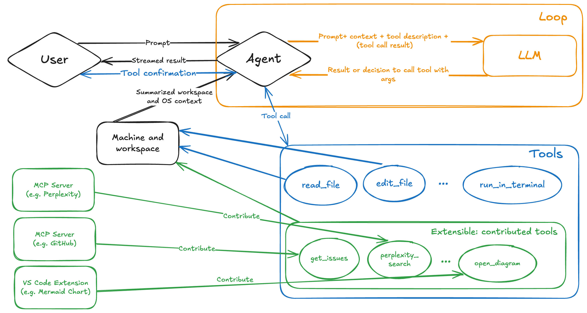
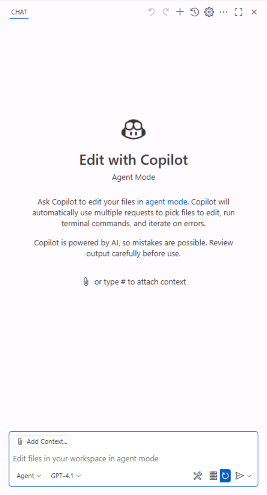
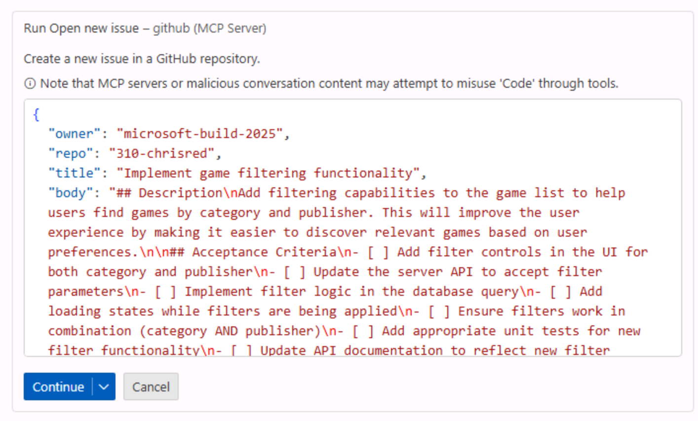
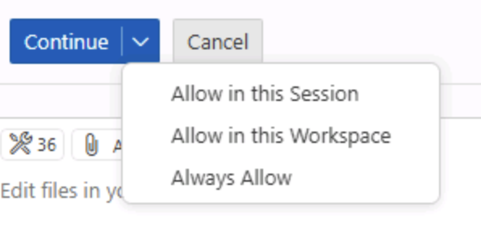

# Exercise 1: Setting up the backlog with Copilot Agent Mode and GitHub's MCP Server

You are a part-time developer for Tailspin Toys - a crowdfunding platform for board games with a developer theme. An initial site has been created, with an ability to list games and display details. Your organization is keen to add functionality as quickly as possible to the site to help drive more backers to more games.

In this first exercise, you will set up your backlog of work for the rest of the lab. But rather than creating the issues through the GitHub User Interface, you will use GitHub Copilot Chat Agent Mode and the GitHub Model Context Protocol (MCP) server to create the issues for you. 

To achieve this, you will learn:
- What Model Context Protocol (MCP) is and how it provides access to external tools and capabilities.
- How to set up the GitHub MCP server in your repository.
- How to use GitHub Copilot Chat Agent Mode to create issues in your repository.

By the end of this exercise, you will have created a backlog of GitHub Issues for use throughout the remainder of the lab.

## What is Model Context Protocol (MCP)?

Model Context Protocol (MCP) provides AI agents with a way to communicate with external tools and services. In the past, you may have interacted with AI agents that could only respond to your queries based on the information they had been trained on, or by using [Retrieval-Augmented Generation (RAG)](https://en.wikipedia.org/wiki/Retrieval-augmented_generation) techniques.

However, with MCP, AI agents can now communicate with external tools and services in real-time. This allows them to access up-to-date information (**using resources**) and perform actions on your behalf (**using tools**). This means that AI agents can now be more useful and effective in helping you with your tasks.

These tools and resources are accessed through an MCP server, which acts as a bridge between the AI agent and the external tools and services. The MCP server is responsible for managing the communication between the AI agent and the external tools (such as existing APIs or local tools like NPM packages). Each MCP server represents a different set of tools and resources that the AI agent can access.



Existing MCP servers include:

- **[GitHub MCP Server](https://github.com/github/github-mcp-server)**: This server provides access to a set of APIs for managing your GitHub repositories. It allows the AI agent to perform actions such as creating new repositories, updating existing ones, and managing issues and pull requests.
- **[Playwright MCP Server](https://github.com/microsoft/playwright-mcp)**: This server provides browser automation capabilities using Playwright. It allows the AI agent to perform actions such as navigating to web pages, filling out forms, and clicking buttons.
- **Additional reference servers**: There are many other MCP servers available that provide access to different tools and resources. Anthropic [has a list](https://github.com/modelcontextprotocol/servers) of reference implementations, third-party implementations, and community implementations of MCP servers. 

MCP servers are designed to be modular and extensible, allowing developers to create their own servers that provide access to custom tools and resources. This means that you can create your own MCP server that provides access to the tools or resources that you need for your specific use case.

> [!IMPORTANT]
> MCP servers are like any other dependency in your project. Before using an MCP server, carefully review its source code, verify the publisher, and consider the security implications. Only use MCP servers that you trust and be cautious about granting access to sensitive resources or operations.

They are compatible with AI agents that support the MCP protocol, including GitHub Copilot Chat and other third-party tools. This means that rather than writing an integration for each AI agent, you can write a single integration for the MCP server and have it work with a number of compatible AI agents.

[Learn more about Model Context Protocol (MCP) on the GitHub Blog](https://github.blog/ai-and-ml/llms/what-the-heck-is-mcp-and-why-is-everyone-talking-about-it/)

## What is GitHub Copilot Chat Agent Mode?

Agent Mode in GitHub Copilot Chat transforms Copilot into an AI agent that can perform actions on your behalf. This mode allows you to interact with Copilot in a more dynamic way, enabling it to use tools and execute tasks, like running tests or terminal commands, reading problems from the editor, and using those insights to update your code. This allows for a more interactive and collaborative workflow, enabling you to leverage the capabilities of AI in your development process.

To access GitHub Copilot Chat Agent Mode, you need to have the GitHub Copilot Chat extension installed in your IDE (which should already be the case if you using a GitHub Codespace!).

> [!TIP]
> If you do not have the GitHub Copilot Chat extension installed, you can [install it from the Visual Studio Code Marketplace](https://marketplace.visualstudio.com/items?itemName=GitHub.copilot). Or open the Extensions view in Visual Studio Code, search for **GitHub Copilot Chat**, and click **Install**.

Once you have the extension installed, you may need to authenticate with your GitHub account to enable it.

1. Click on the Copilot Chat icon at the top of your Visual Studio Code window.
2. If you are not already authenticated, you will be prompted to sign in to your GitHub account. Follow the instructions to authenticate.

    

3. After authentication, you should see the Copilot Chat window appear.

    

4. Switch to agent mode by clicking on the dropdown in the Copilot Chat window and selecting **Agent**. Set the model to **Claude 3.5 Sonnet**.

    

5. The chat pane should update to indicate that you are now in Agent Mode. You should see a tools icon, showing that we can configure tools for GitHub Copilot to use.

    

6. Typically, the number of tools available will be set to 0 when setting up a new project, as we have not configured any MCP servers yet. But to help you get started, we have created a `.vscode/mcp.json` file with an example configuration for the [GitHub MCP server](https://github.com/github/github-mcp-server). Let's go and explore that next.

## Setting up the GitHub MCP server

To recap, the `.vscode/mcp.json` file is used to configure the MCP servers that are available in this Visual Studio Code Workspace. The MCP servers provide access to external tools and resources that GitHub Copilot can use to perform actions on your behalf.

1. Open up the `.vscode/mcp.json` file in your repository.
2. You should see a JSON structure similar to the following:

    ```json
    {
        "inputs": [
        {
            "type": "promptString",
            "id": "github_token",
            "description": "GitHub Personal Access Token",
            "password": true
        }
        ],
        "servers": {
        "github": {
            "command": "docker",
            "args": [
            "run",
            "-i",
            "--rm",
            "-e",
            "GITHUB_PERSONAL_ACCESS_TOKEN",
            "ghcr.io/github/github-mcp-server"
            ],
            "env": {
            "GITHUB_PERSONAL_ACCESS_TOKEN": "${input:github_token}"
            }
        }
        }
    }
    ```

The **inputs** section defines the inputs that the MCP server will require. In this case, we are asking for a GitHub Personal Access Token, which is required to authenticate with the GitHub API. The `password` field is set to `true`, which means that the input will be masked when you enter it.

> [!IMPORTANT]
> Make sure that you do not share your GitHub Personal Access Token with anyone, as it provides access to your GitHub account and repositories. Treat it like a password and keep it secure. That means you should not check it into source control or share it with anyone else.

The **servers** section defines the MCP server that you want to use. In this case, we are using the GitHub MCP server, which is run in a Docker container. The **command** field specifies the command to run the MCP server, and the **args** field specifies the arguments to pass to the command. The **env** field specifies the environment variables to set when running the MCP server. The **GITHUB_PERSONAL_ACCESS_TOKEN** environment variable is set to the value of the **github_token** input, which is provided by the user when prompted.

1. To start the GitHub MCP server, click on **Start** above the GitHub server entry in the **.vscode/mcp.json** file.
2. You should see a prompt asking for the GitHub Personal Access Token.

> [!NOTE]
> **If you are using a GitHub Codespace**, you can use the GITHUB_TOKEN environment variable as your Personal Access Token.
>
> 1. Open the terminal in your Codespace.
> 2. Run the following command to print the value of the GITHUB_TOKEN environment variable:
> ```bash
> echo $GITHUB_TOKEN
> ```
> 
> **If not using a Codespace**, you can [create a Personal Access Token](https://docs.github.com/en/authentication/keeping-your-account-and-data-secure/managing-your-personal-access-tokens#creating-a-fine-grained-personal-access-token) in your GitHub account with the necessary permissions. You can use a fine-grained token, with the following repository permissions:
> - Contents: Read
> - Issues: Read and Write
> - Pull Requests: Read and Write

3. Paste the value of your GitHub Personal Access Token into the prompt and press Enter.

    

> [!IMPORTANT]
> Do not share your Personal Access Token with anyone, as it provides access to your GitHub account and repositories. 
>
> Treat it like a password and keep it secure. That includes not checking it into source control; **do not paste it directly into the .vscode/mcp.json file**.

4. The GitHub MCP server should start up, and you should now see the number of tools available in the Copilot Chat window increase from 0. This indicates that the AI agent is now able to access the GitHub MCP server and perform actions on your behalf.

    

5. You can click on the tools icon to see the list of available tools that the GitHub MCP server provides. This includes tools for creating and managing repositories, issues, pull requests, and more.

## Creating a backlog of tasks

Now that you have set up the GitHub MCP server, you can use Copilot Agent mode to create a backlog of tasks for use in the rest of the lab.

1. Navigate to the Copilot Chat pane. Select **Agent** from the dropdown list. Set the model to **Claude 3.5 Sonnet**.

    

2. Type or paste the following prompt. Note that you will need to replace **micro/repository** with the name of your GitHub repository, e.g. Microsoft-Build-2025/your-repo-name:

```markdown
Create GitHub issues for our Tailspin Toys backlog in the **organization-name/repository** repo.  Each issue should include:
- A clear title
- A brief description of the task and why it is important to the project
- A checkbox list of acceptance criteria / definition of done

From our recent planning meeting, the upcoming backlog includes the following tasks:

1. Create a new Flask endpoint to list categories (server/app.py, models/category.py) and a Svelte component to display categories (client/src/components).
2. Define our repository coding standards (including updating or adding tests when implementation changes) in a Copilot instructions file
3. Build a Svelte component to display categories (client/src/components)
4. Add input validation and error handling to the Flask API
5. Stretch Goal: Implement pagination on the game listing endpoint.
6. Stretch Goal: Standardize code style & enforce linting/formatting
7. Rewrite the backend to .NET, and update the scripts to launch the backend.
8. Create a form where users can indicate interest in a game and be contacted as a backer. The form should be accessible by a button on the game details page, prompting for basic information without any auth. On success, store the information in the database and clearly show success.
9. Create a GitHub Actions workflow which builds and tests the client and server components.
```

2. Press enter or hit the **Send** button to send the prompt to Copilot.
3. GitHub Copilot should process the request and respond with a dialog box asking you to confirm the creation of the issues.

    

> [!IMPORTANT]
> Remember, AI can make mistakes, so make sure to review the issues before confirming.
>
> Click the arrow next to **Run create_issue** to see the details of the issue that will be created. You should review or edit them before clicking **Continue** to create the issue.
>
> **Make sure that the details in the **owner** and **repo** are correct. You can directly edit the JSON Body that Copilot has proposed by double clicking it and typing the correct information.**



4. Once you have created the first issue, you will need to follow the same process for each of the eight tasks.

> [!TIP]
> If you are comfortable with Copilot automatically creating the issues, then you can click the arrow next to **Continue** and either **Allow in this session**, **Allow in this workspace** or **Allow All**.
>
> Depending on which option you select, this will allow Copilot to automatically create the issues without asking for confirmation each time.
>
> This may be useful in scenarios where you have a large number of actions to complete. However, you won't have the chance to review the details before the action is taken, so take caution when using this approach. If you had to update the owner or repo properties, you should continue to review the details on each issue before proceeding. Remember, you could pass the owner and repo name in the prompt to provide Copilot with the needed context.



5. Navigate to your GitHub repository and check the issues tab. You should see a list of issues that have been created by Copilot. Each issue should include a clear title and a checkbox list of acceptance criteria / definition of done.

You should notice that the issues are fairly detailed. This is where we benefit from the power of Large Language Models (LLMs) and Model Context Protocol (MCP), as it has been able to create a clear initial issue description.


## Summary

Congratulations, you have complete the exercise!

To recap, in this exercise we have:

- Learned about Model Context Protocol (MCP) and how it provides access to external tools and resources, allowing AI agents to perform actions on your behalf.
- Successfully created your backlog of work by using [GitHub Copilot Chat Agent Mode](https://code.visualstudio.com/docs/copilot/chat/chat-agent-mode) and the [GitHub MCP server](https://github.com/github/github-mcp-server).

With the GitHub MCP server configured, you can now use GitHub Copilot Chat Agent Mode to perform additional actions on your behalf, like creating new repositories, managing pull requests, and searching for information across your repositories.

You can now continue to the next exercise, where you will learn how to use GitHub Copilot Chat Agent Mode to make changes to your codebase and begin implementing the tasks in your backlog.

### Optional: Bonus Exercise – Setting up the Microsoft Playwright MCP server

If you are feeling adventurous, you can try installing and configuring another MCP server, such as the [Microsoft Playwright MCP server](https://github.com/microsoft/playwright-mcp). This will allow you to use GitHub Copilot Chat Agent Mode to perform browser automation tasks, such as navigating to web pages, filling out forms, and clicking buttons.

You can find the instructions for installing and configuring the Playwright MCP server in the [Playwright MCP repository](https://github.com/microsoft/playwright-mcp).

Notice that the setup process is similar to the GitHub MCP server, but you do not need to provide any credentials like the GitHub Personal Access Token. This is because the Playwright MCP server does not require authentication to access its capabilities.
